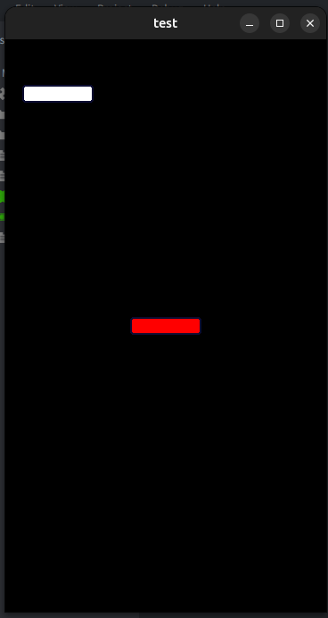

## Bug Report

I wanted to share an issue I’ve run into while working on a project. I appreciate your time and help.

### Summary

I'm loading an inner collection using a proxy, and it includes:

- A camera
- A UI node that uses a material ("a_test")

The material is designed to check if the color is white, if so, change it to red.

### Issue

- When the camera is active, the UI node with that material doesn't render at all.
- If I remove the camera, the node renders correctly.
- The same material works fine on a sprite, even with the camera active.

#### Render with camera



#### Render without camera


### Notes

- I recently notice that the proxy may not be problem, I loaded the inner collection directly and still results in the same issue.

```
  [bootstrap]
  main_collection = /main/inner.collectionc
```
